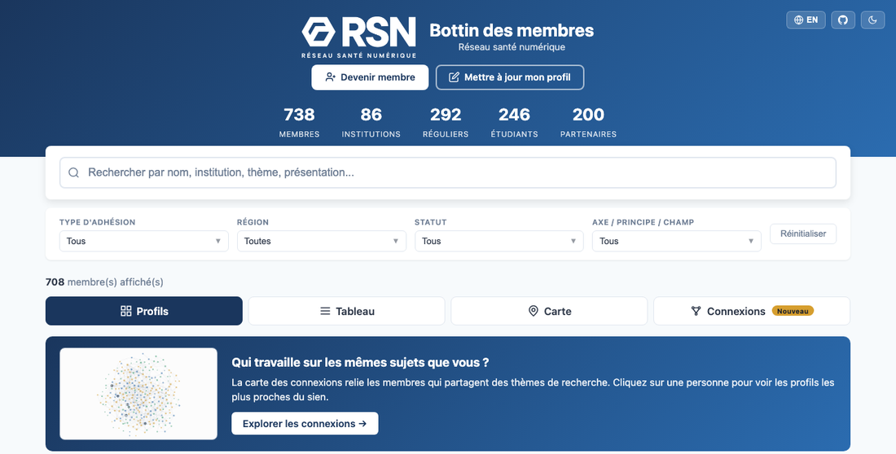
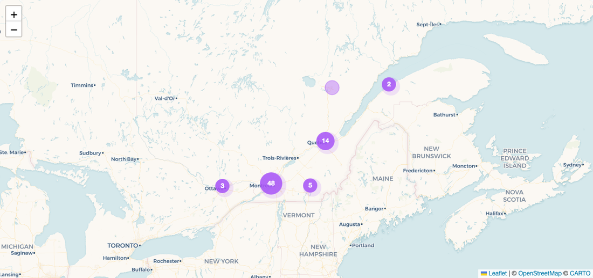
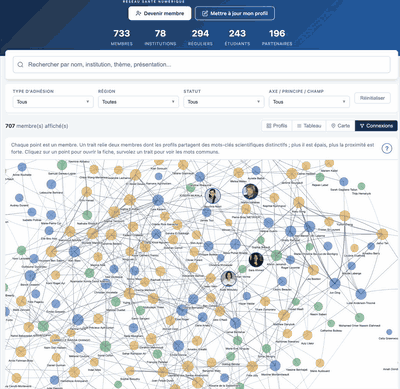
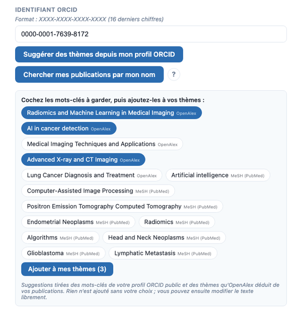

# Bottin des membres du Réseau santé numérique

**[bottin.rsn.quebec](https://bottin.rsn.quebec/)**

> *In English:* an open member directory for a research network. Members appear as profile cards, on a map of institutions, and on a "connections" graph that links people working on similar topics. Members update their own profile through a one-click email link, with keyword suggestions drawn from ORCID and OpenAlex. Data lives in Notion, the site runs on Vercel, emails go through Resend. Everything below is in French; the technical section at the end lists what you need to run your own copy.

Le bottin est le répertoire public des membres du [Réseau santé numérique](https://rsn.quebec/) (RSN), un réseau de recherche québécois financé par le Fonds de recherche du Québec. Il sert à une chose : **trouver les bonnes personnes**. Qui travaille en santé numérique au Québec, où, sur quels sujets, et avec qui.

## Ce que l'on y trouve

### Des profils, une recherche et des filtres

Chaque membre a une fiche : statut, institution, thèmes de recherche, présentation, photo, liens ORCID et site web. La barre de recherche comprend les noms, les institutions, les thèmes et les présentations, en français comme en anglais. Quatre filtres croisent le type d'adhésion, la région, le statut et les axes du réseau. Une vue en tableau, triable, remplace les cartes quand on préfère une liste.



### Une carte des institutions

Chaque membre est placé sur la carte à partir de son institution, de Montréal à Rimouski, avec des membres ailleurs au Canada et à l'international. Les filtres s'appliquent aussi à la carte.



### Des institutions référencées

Les institutions ne sont pas du texte libre : elles forment un catalogue à part, avec pour chacune une adresse, des coordonnées et un statut. Au moment de l'adhésion ou d'une mise à jour, le champ « institution » propose celles qui existent déjà au fil de la frappe ; si la sienne manque, la personne l'ajoute avec son adresse, et elle est placée sur la carte automatiquement à partir de cette adresse. L'équipe du réseau valide ensuite la nouvelle institution, et peut compléter sa fiche. C'est ce catalogue qui alimente la carte et le filtre par région ; renommer une institution dans le catalogue met à jour tous les membres qui y sont rattachés.

### Les connexions

C'est la partie la plus originale. Un graphe relie les membres dont les profils partagent des mots-clés scientifiques distinctifs : plus deux personnes ont de mots rares en commun, plus le trait est épais. Un clic sur une personne ouvre sa fiche avec la liste de ses profils les plus proches et les mots-clés partagés. Le calcul se fait dans le navigateur, sans intelligence artificielle, à partir des thèmes et des présentations, et un bouton « ? » explique la méthode aux membres.

<p align="center"></p>

### Un profil qui se remplit presque tout seul

Pour créer ou modifier son profil, un membre reçoit un lien par courriel, sans mot de passe. Le formulaire propose ses thèmes de recherche à partir de son identifiant ORCID, ou d'une recherche de ses publications par son nom dans OpenAlex ; la personne coche ce qui lui convient. Elle peut ajouter une photo, recadrée sur place. Toute modification passe par l'approbation de l'équipe du réseau avant d'apparaître.



### Le consentement, au centre

C'est un bottin de personnes, soumis à la Loi 25 du Québec. Chaque membre décide si son profil est public. Sans réponse, seuls le nom, le type d'adhésion et les axes apparaissent, le reste est masqué ; en cas de refus, la personne n'apparaît pas du tout et n'est comptée que dans les totaux. Le courriel n'est affiché que si la personne l'a accepté, et elle peut retirer son consentement à tout moment depuis son profil.

## Sur quoi ça repose

| Brique | Rôle | Coût |
|---|---|---|
| [Notion](https://notion.so) | La base de données des membres et celle des institutions. L'équipe du réseau y approuve les demandes, corrige une fiche ou change un libellé sans toucher au code. | gratuit |
| [Vercel](https://vercel.com) | Héberge le site et ses douze petites fonctions serveur : export des données, formulaires, liens par courriel, photos, sauvegardes, campagne. Deux tâches planifiées : l'une chaque matin, l'autre chaque semaine. | gratuit, forfait Hobby |
| [Resend](https://resend.com) | Envoie tous les courriels : lien de modification, confirmation d'inscription, acceptation, rappels de renouvellement, campagne. | gratuit jusqu'à 100 courriels par jour |
| [ORCID](https://orcid.org) et [OpenAlex](https://openalex.org) | Sources publiques des suggestions de thèmes : mots-clés et publications d'un profil ORCID, thèmes et termes MeSH calculés par OpenAlex. Interrogés directement par le navigateur, sans compte. | gratuit |
| [CARTO](https://carto.com/basemaps) et [OpenStreetMap](https://www.openstreetmap.org) | Le fond de carte. CARTO avec une clé gratuite ; OpenStreetMap en repli, sans clé. | gratuit |
| [Nominatim](https://nominatim.org) (OpenStreetMap) | Transforme l'adresse d'une nouvelle institution en coordonnées pour la carte. | gratuit, usage modéré |
| [Leaflet](https://leafletjs.com), [vis-network](https://visjs.org), [Fuse.js](https://www.fusejs.io) | Bibliothèques ouvertes pour la carte, le graphe des connexions et la recherche tolérante aux fautes. | libres |
| [GitHub](https://github.com/TessRSN/Bottin) | Le code, et le déploiement automatique sur Vercel à chaque changement. | gratuit |

Aucun serveur à entretenir, aucune base de données à administrer : le site est une page statique, les fonctions ne tournent qu'à la demande, et Notion reste la seule source de vérité. Une équipe qui sait utiliser Notion peut faire vivre le bottin au quotidien.

## Comment ça marche, côté équipe

1. **Une personne demande l'adhésion** sur le site. Sa fiche apparaît dans Notion avec le statut « Nouveau » ; l'équipe l'approuve ou la refuse, et un courriel d'acceptation part automatiquement.
2. **Un membre met son profil à jour** avec le lien reçu par courriel. Comme la personne est la seule à pouvoir modifier sa fiche, les changements sont publiés immédiatement, sans revue ; la date de modification est notée dans Notion.
3. **Une institution proposée** par un membre arrive dans le catalogue avec le statut « En attente », déjà géolocalisée ; l'équipe vérifie le nom et l'adresse, complète au besoin, puis la passe en « Validée » pour qu'elle apparaisse sur la carte et dans les suggestions.
4. **L'adhésion dure deux ans.** Des rappels partent 60 puis 30 jours avant l'échéance, avec un lien de renouvellement en un clic ; sans réponse, la fiche est archivée.
5. **Une campagne** peut inviter les membres au profil incomplet à le compléter, à raison d'un lot par jour, chaque envoi étant noté dans Notion pour ne jamais écrire deux fois à la même personne.
6. **Une sauvegarde** de la base part chaque semaine, et une page d'administration permet d'en lancer une à la main.

Contact : Tess Berthier, [tess.berthier@rimuhc.ca](mailto:tess.berthier@rimuhc.ca).

---

## Pour installer son propre bottin

Cette partie s'adresse à qui veut reprendre l'outil pour un autre réseau. Comptez une demi-journée pour une première mise en ligne, avec des connaissances de base en Git et en Vercel ; aucune installation locale n'est nécessaire.

### Prérequis

- Un compte **Notion** avec une intégration interne (Paramètres → Connexions → Développer ou gérer des intégrations) et deux bases de données : les membres et les institutions.
- Un compte **Vercel** (forfait Hobby) relié à un dépôt **GitHub** contenant une copie de ce projet.
- Un compte **Resend** avec un domaine d'envoi vérifié (par exemple `bottin.votre-domaine.ca`).
- Facultatif : une clé **CARTO Basemaps** pour le fond de carte pastel ; sans elle, la carte utilise OpenStreetMap.

### Structure du projet

```
index.html          le bottin : profils, tableau, carte, connexions
join.html           formulaire d'adhésion
edit.html           formulaire de modification (ouvert par lien courriel)
magic-link.html     demande du lien de modification
renew.html          renouvellement de l'adhésion
backups.html        page d'administration des sauvegardes
orcid-suggest.js    suggestions de thèmes (ORCID, OpenAlex)
photo-cropper.js    recadrage de la photo de profil
api/                fonctions serveur (Vercel) : export, join, profile, magic-link,
                    email-change, renew, photo, institutions, backups, backup-auto,
                    campaign, membership-report
lib/                accès Notion, courriels (Resend), jetons, campagne, photos, géocodage
img/                images du site et du README
vercel.json         tâches planifiées, réécritures d'adresses, en-têtes
BACKLOG.md          chantiers en cours et décisions de données
```

### Base Notion « Membres »

Les noms des propriétés doivent correspondre exactement à ceux du fichier `lib/notion.js` (objet `PROP`). Les principales :

| Propriété | Type | Rôle |
|---|---|---|
| Prénom | Titre | prénom |
| Nom | Texte | nom de famille |
| Email, Email secondaire | Courriel | le premier sert aux liens de modification |
| Institution | Texte | affiliations, séparées par `;` |
| Institution liée | Relation | vers la base Institutions, prioritaire pour la carte |
| Statut | Sélection | 14 statuts, du 1er cycle à la coordination de recherche |
| Type d'adhésion | Sélection | Régulier, Étudiant, Partenaire |
| Thèmes de recherche ou d'intérêt | Texte | mots-clés séparés par des virgules ; base des connexions |
| Présentation | Texte | quelques phrases ; base des connexions |
| Axes d'intérêt, Principes fondateurs, Champs d'action | Multi-sélection | taxonomie du réseau |
| ORCID, CV / LinkedIn | URL | liens de la fiche |
| Photo | Fichiers | photo de profil, téléversée par le formulaire |
| Consentement | Sélection | Oui, Non, ou vide |
| Afficher courriel | Case à cocher | courriel visible sur la fiche |
| Statut workflow | Sélection | Nouveau, Approuvé, Refusé ; seules les fiches approuvées sont publiées |
| Date de début d'adhésion, Date de renouvellement | Date | cycle de deux ans |
| Email d'acceptation envoyé, Email renouv. 60j envoyé, Email renouv. 30j envoyé, Email archivage envoyé | Cases à cocher | courriels déjà partis, pour ne jamais les renvoyer |
| Réseau, Étudiants, Référé par, Droit de vote, Évaluateur | Divers | champs propres au RSN, facultatifs |
| OpenAlex ID, Courriel campagne profil, Profil modifié le | Texte, Date, Date | techniques : fiche OpenAlex choisie, date du courriel de campagne, dernière modification par le membre |

Base « Institutions » : `Nom` (titre), `Adresse` (texte), `Latitude` et `Longitude` (nombres), `Statut` (sélection : « En attente » à la création par un membre, « Validée » une fois vérifiée ; seules les institutions validées sont servies au site). Les coordonnées sont remplies automatiquement à partir de l'adresse (Nominatim) et peuvent être corrigées à la main. Les régions de la carte sont déduites des coordonnées.

### Variables d'environnement (Vercel)

| Variable | Obligatoire | Rôle |
|---|---|---|
| `NOTION_KEY` | oui | jeton de l'intégration Notion |
| `NOTION_DB_ID` | oui | identifiant de la base Membres |
| `NOTION_INSTITUTIONS_DB_ID` | oui | identifiant de la base Institutions |
| `RESEND_API_KEY` | oui | clé Resend |
| `RESEND_FROM_EMAIL`, `RESEND_FROM_NAME` | non | expéditeur des courriels (défaut : `bottin@rsn.quebec`, « RSN — Bottin ») |
| `JWT_SECRET` | oui | secret des liens signés (modification 1 h, renouvellement 90 jours, campagne 30 jours) |
| `BASE_URL` | non | adresse publique du site, utilisée dans les courriels (défaut : `https://bottin.rsn.quebec`) |
| `BACKUP_SECRET` | oui | clé des pages et actions d'administration (sauvegardes, campagne, catalogue complet) |
| `CRON_SECRET` | oui | protège la sauvegarde hebdomadaire contre un appel direct |
| `ADMIN_NOTIFICATION_RECIPIENTS` | non | courriels de l'équipe pour le récapitulatif des échéances |
| `EMAIL_DAILY_BUDGET` | non | plafond de courriels automatiques par passage du matin (défaut 95, sous les 100/jour de Resend) |
| `RETENTION_EMAILS_ENABLED`, `RETENTION_EMAILS_DAILY_LIMIT`, `RETENTION_EMAILS_TEST_RECIPIENTS` | non | rappels de renouvellement : activation (`true`), plafond (défaut 30), liste de test |
| `CAMPAIGN_DAILY_LIMIT`, `CAMPAIGN_PAUSED` | non | campagne « complétez votre profil » : plafond (défaut 40), pause (`true`) |
| `EMAIL_TEST_MODE`, `EMAIL_TEST_RECIPIENT` | non | sur un environnement de test, redirige tous les courriels vers une seule adresse |
| `CARTO_BASEMAP_KEY` | non | clé du fond de carte CARTO ; sans elle, OpenStreetMap |

Un changement de variable ne prend effet qu'au déploiement suivant.

### Tâches planifiées

`vercel.json` déclare les deux tâches autorisées par le forfait Hobby :

- `/api/export` chaque jour à 11 h 30 UTC (7 h 30 au Québec) : régénère l'export, envoie les courriels d'acceptation, les rappels de renouvellement, l'archivage des adhésions échues et le lot du jour de la campagne.
- `/api/backup-auto` chaque dimanche à 3 h UTC : sauvegarde complète de la base.

L'export est aussi appelé en direct par le site à chaque visite, avec un cache par empreinte : les visiteurs voient toujours des données à jour.

### Mise en route

1. Créer les deux bases Notion avec les propriétés ci-dessus, et y connecter l'intégration.
2. Copier ce dépôt sur GitHub, l'importer dans Vercel, renseigner les variables, déployer.
3. Dans Resend, vérifier le domaine d'envoi et ajuster `RESEND_FROM_EMAIL`.
4. Adapter les textes propres au réseau : taxonomie des axes, principes et champs (dans `index.html`, `join.html`, `edit.html` et `api/membership-report.js`), courriels (`lib/email.js`), logo et images (`logo-rsn.png`, `og-image-v3.png`, `img/`).
5. Tester : demander l'adhésion avec une adresse de test, approuver dans Notion, demander un lien de modification, modifier, approuver.

### Limites à connaître

- Vercel Hobby : au plus 12 fonctions serveur (toutes utilisées ici) et 2 tâches planifiées ; une fonction s'exécute au plus 60 secondes.
- Resend gratuit : 100 courriels par jour, 3 000 par mois. Les envois automatiques sont plafonnés en conséquence.
- Notion : environ 3 requêtes par seconde ; les scripts qui écrivent en série respectent une pause. Notion ne fixe pas de plafond au nombre de fiches sur un espace personnel gratuit ; un espace d'équipe gratuit est limité à un essai de 1 000 blocs, chaque fiche en comptant au moins un, donc prévoir le forfait Plus au-delà de quelques centaines de membres et d'institutions. La limite pratique est le temps de lecture : Notion livre 100 fiches par requête, et l'export lit toute la base à chaque passage. Avec 740 membres et 150 institutions, l'export prend 3 à 5 secondes ; il resterait sous la limite de 60 secondes jusqu'à plusieurs milliers de fiches, mais le fichier envoyé au navigateur grossirait d'autant.
- Nominatim : une requête par seconde au plus, et une adresse imprécise peut ne pas être trouvée ; l'institution est alors créée sans coordonnées, à compléter dans Notion.
- Les fichiers Notion, dont les photos, ont des adresses temporaires : le site les sert par un relais qui les met en cache.

## Licence

Ce projet est partagé librement pour que d'autres réseaux de recherche puissent s'en inspirer.
